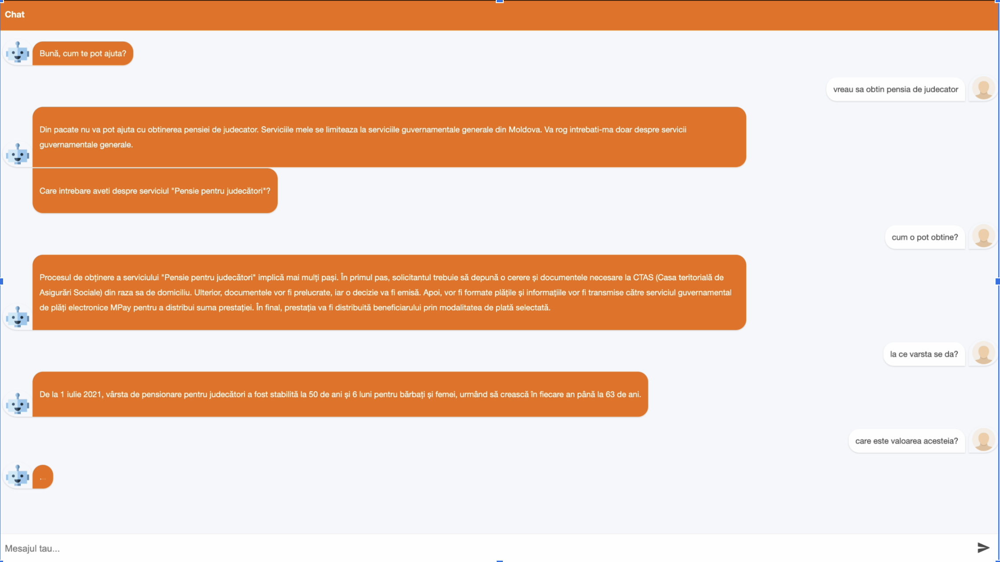
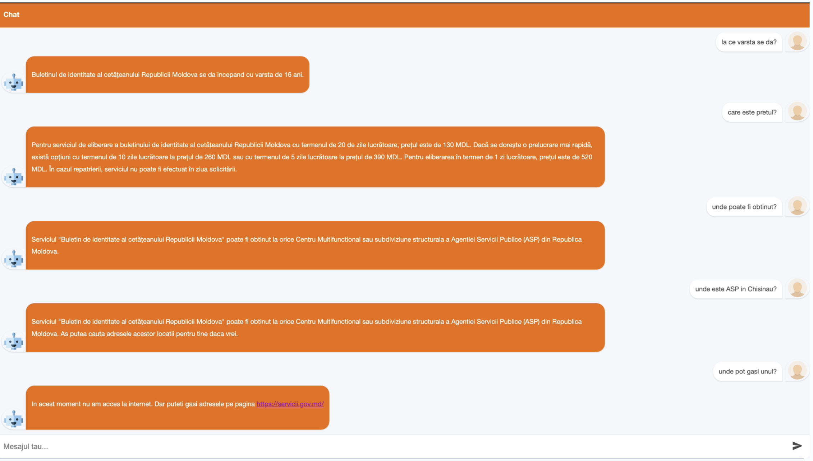

# Solution to GovTech challenge (Gigahack hackathon)
POC of a chat bot using own data (with fine tuning + retrieval augmented generation).   
The data is the full collection of documents from the https://servicii.gov.md portal.  
This is a solution for the GovTech Challenge hackathon: https://gigahack.md/.

## Final presentation
* [Slides](https://docs.google.com/presentation/d/1Q-h3nsrZVHojarzDQeJV93SvzKgr9GVHi1Uobz_7wRo/edit?usp=sharing)
* [Video](https://www.youtube.com/watch?v=RO0qY_TyPgI)

## Example

## The challenge
Gov Challenge - *Streamline and elevate the customer experience.*

The Electronic Governance Agency invites participants to develop within the EVO government application and a web 
interface a module based on AI technologies that assists citizens in the process of obtaining information about public 
services. The module should include a conversational interface that enables dynamic interactions with users, allowing 
them to ask questions, make requests, and seek the necessary clarifications to receive logical answers based on the 
descriptions of public services available at: https://servicii.gov.md.

Evaluation Criteria:
* Understanding User Needs and Requirements: Work closely with the Electronic Governance Agency and relevant stakeholders to understand the specific needs and requirements of citizens. Identify the types of public services most frequently inquired about and the potential questions citizens might have.
* Creating a Conversational Flow: Design a conversational flow that guides users through their queries. Define different user intents (e.g., querying a service, asking for clarifications, requesting forms), and map them to appropriate responses.
* User Training and Support: Provide clear instructions on how to use the application and the web interface.
* Scalability and Future Enhancements: As usage grows, ensure that the system can handle increased load. Consider adding more features over time.

## Data
The project will utilize the extensive dataset from the Public Service Portal, including detailed information about 
various government services, service steps, terms, associated fees, legal frameworks, and more. 
This dataset will serve as the foundation for generating accurate and contextually relevant responses to user queries.
Government services are freely accessible via a HTTP REST interface with OpenAPI description available at this address: 
https://servicii.gov.md/swagger/index.html
In short, to get the data for all services, one can:
1) list service categories using GET https://servicii.gov.md/rsspa-api/catalog/categories
2) then list public services for each category using GET
https://servicii.gov.md/rsspa-api/catalog/categories/{categoryld}
3) then get details for each service in the category using GET
https://servicii.gov.md/rsspa-api/public-service/code/{code}
A sample public service description can be accessed here:
https://servicii.gov.md/rsspa-api/public-service/code/006000022
